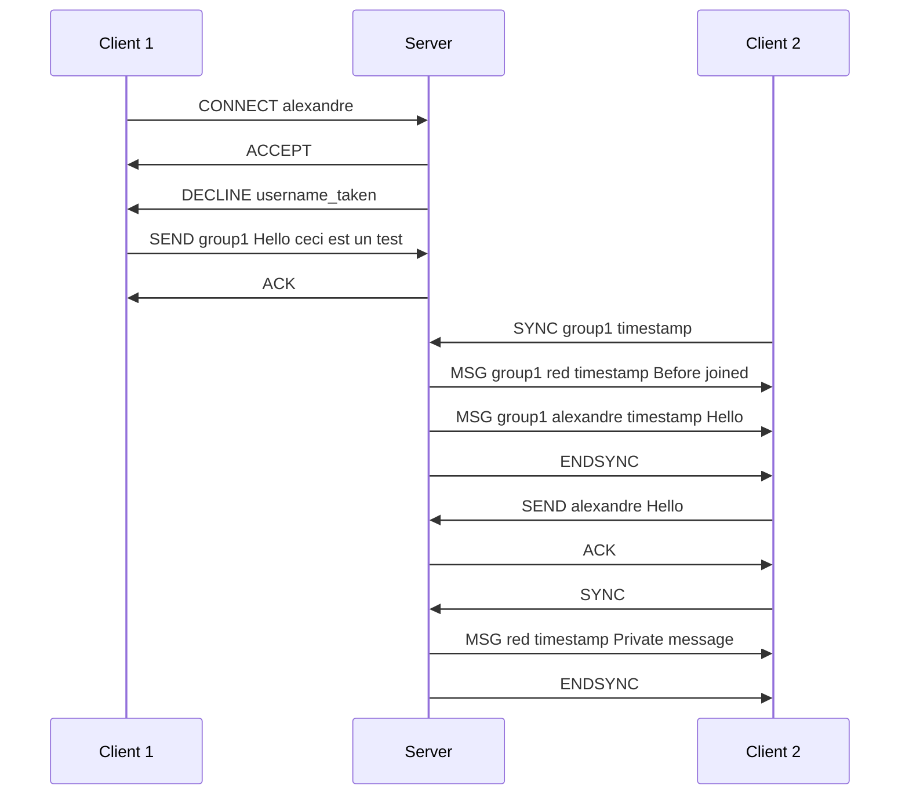

# Chat protocol for texting

This document outlines the chat protocol for Texting (CPT).

## Conventions Used in This Document

The key words "MUST", "MUST NOT", "REQUIRED", "SHALL", "SHALL NOT",    
"SHOULD", "SHOULD NOT", "RECOMMENDED", "MAY", and "OPTIONAL" in this    
document are to be interpreted as described in RFC 2119 [RFC2119].

For commands, parameters are enclosed in brackets. **Required** parameters are enclosed in angled brackets `<>`, while *
*optional** parameters are in square brackets `[]`.

For example, `test <sub command> [target]` describes the `test` command, with a required `sub command` parameter in
first position, and an optional `target` in second.

## Communication layer

The CPT layer is based on the TCP communication layer.

The CPT protocol uses a RECOMMENDED port of `39168`, but the server MAY use another port.

## Commands

The commands described in this document is in logical order for a common connection, and does only differentiate their
types within the contents.

### CONNECT

```  
CONNECT <username>  
```  

Client to Server

Begins a connection to the remote service, asking for a username in the required parameter.

The server SHALL answer with an `DECLINE` command if the user is already taken, or IF additional requirements are set by
the implementation. If not, the server MUST answer with an `ACCEPT` command.

### ACCEPT

```  
ACCEPT  
```  

Server to Client

Signals that the server accepts the connection, and acknowledges the username chosen by the client.

No answer is required for the client.

### DECLINE

```  
DECLINE <reason>  
```  

Server to Client

Signals that the server has declined the client request. The client SHOULD close the TCP connection upon the reception
of this packet, and MAY inform the user of the error message.

The reason parameter is required, and describes the reasoning of the denial.

The server MUST use the default reasons described in the table below where applicable, and MAY use custom values.

| reason              | description                                                                                      |  
|---------------------|--------------------------------------------------------------------------------------------------|  
| username_taken      | An user already uses the given username.                                                         |  
| account_locked      | The account is locked by an administrator.                                                       |  
| ip_invalid          | The account is IP range protected, but the client IP does't matches.                             |  
| already_logged_in   | The user has already sent a CONNECT command. Changing suernames is not supported by the protocol |  
| unsupported_command | The server does not support this command                                                         |
| invalid_command     | Unknown command, or invalid command format                                                       |

New values MAY be added in a future revision of this document.

### SEND

```  
SEND <target> <message>  
```

Client to Server

Sends a new `message` to a given `target`. The server MUST respond with either an ACK to confirm the message delivery,
or a DECLINE to indicate an error

### ACK

```  
ACK  
```  

Server to Client

Acknowledge the previous command (e.g. a SEND).    
The client MUST wait for an ACK response before doing another interaction. The client MAY re-send the message if an ACK
message was not received, and the server SHOULD add a deduplication system in the event of duplicated sent messages.

### SYNC

```  
SYNC <group> <after>  
```  

Client to Server

Requests the messages in a given `group` sent after the `after` timestamp.  
The server will respond with multiple `MSG` commands, and terminated with an `ENDSYNC` command.  
The client MUST wait for the ENDSYNC message before resuming interaction with the server. The server MAY create
specially crafted messages, with the reserved username `system`, to indicate an error to the client.

### MSG

```  
MSG <group> <sender> <timespamp> <message>  
```  

Server to Client

Describes a received message from the server.

If this command is in response to a `SYNC` command, the `group` value MUST be set to the requested group. Otherwise, the
server MAY use any valid identifier.

The `sender` is set to the username of the person who sent the message described in the command. The `system` sender is
reserved for server-specific messages and SHOULD not be a valid username.

The `timestamp` value represents the time at which the message was sent. The UNIX epoch is reserved in the case where
either:

1. The server does not know the time where the message was sent
2. An intemporal message by the `system` username (used in announcements)

### ENDSYNC

```  
ENDSYNC  
```  

Server to Client

Terminates the `SYNC` request, indicating that all messages were sent successfully.

The server MUST provide all messages before the time of the `SYNC` command, and MAY provide messages sent during the
transmission.

## Example diagram

