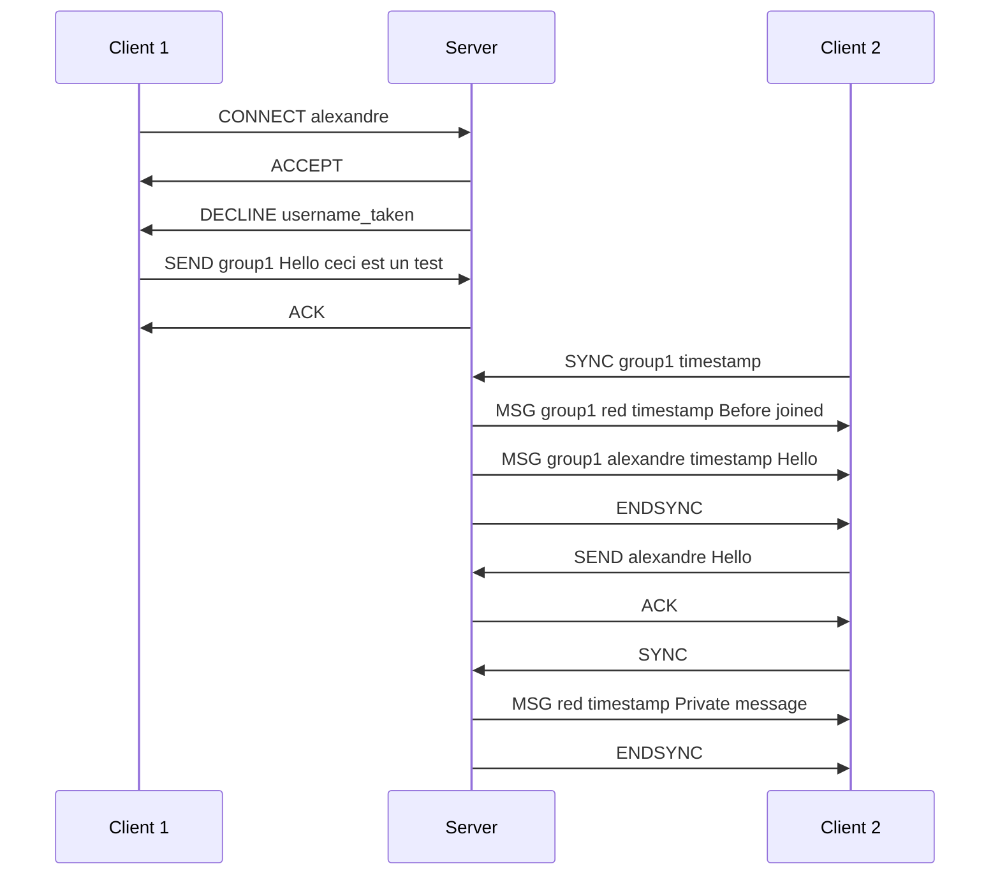

# Chat protocol for texting

This document outline the chat protocol for Texting (CPT).

## Commands

### CONNECT

Connects a client with a given username, returns ACCEPT if the username is not already used, otherwise, return DECLINE.

### ACCEPT

Accepts the user CONNECT with the given username.

### DECLINE

Decline the previous command (e.g. CONNECT).

### SEND

Sends a message to either a user or a group.

### ACK

Acknowledge the previous command (e.g. a SEND).

### SYNC

Requests the server to sync the messages from a given timestamp.

### MSG

Tells a client that he received a message.

### ENDSYNC

Ends the sync request, the client is now up-to-date.

## Example diagram

